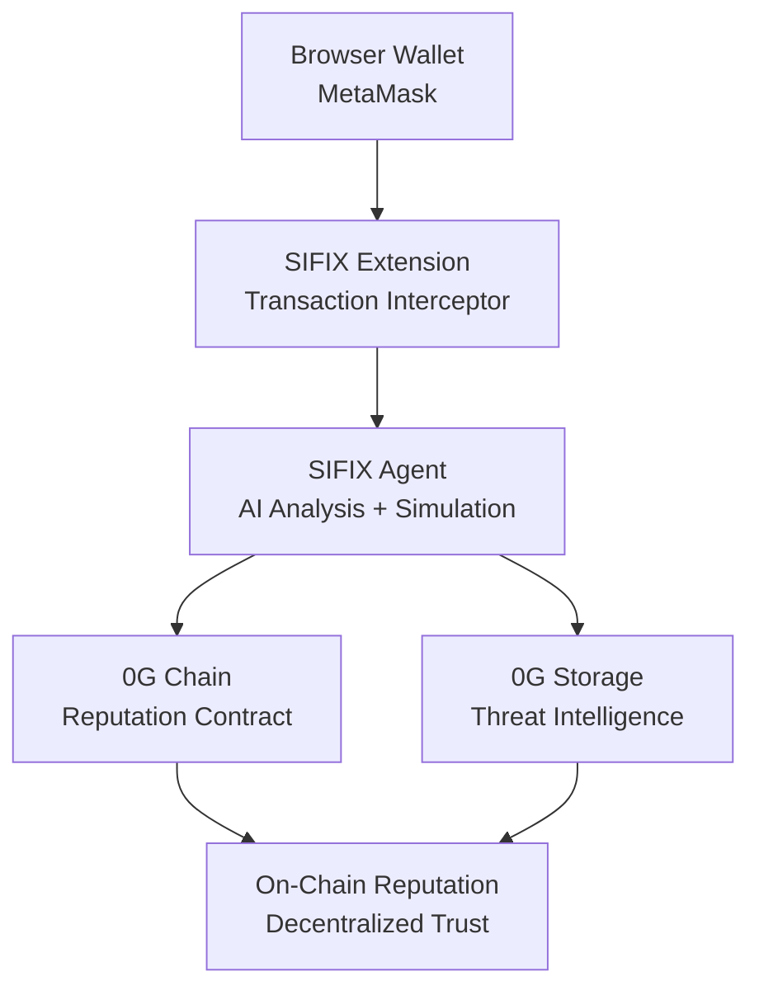

# SIFIX - AI-Powered Wallet Security for Web3

**Autonomous AI agent that protects Web3 users by intercepting wallet transactions, simulating them, analyzing risks using AI, and reporting threats to an on-chain reputation system on 0G Chain.**

Built for 0G Chain APAC Hackathon 2026.

## 🎯 Problem

Web3 users face constant threats:
- Phishing attacks
- Malicious smart contracts
- Rug pulls
- Approval scams
- Hidden risks in complex DeFi interactions

## 💡 Solution

SIFIX adds an AI security layer between users and blockchain:

1. **Intercept** - Catches transactions before execution
2. **Simulate** - Runs transaction in safe environment
3. **Analyze** - AI evaluates risks and explains threats
4. **Report** - Shares threat intelligence on-chain
5. **Protect** - Users make informed decisions

## 🏗️ Architecture



## 📦 Tech Stack

- **Frontend:** Next.js 16 + React 19 + TailwindCSS 4
- **Wallet:** RainbowKit + Wagmi v3 + Viem v2
- **Backend:** Next.js API Routes + Prisma
- **Database:** PostgreSQL / SQLite
- **Extension:** Plasmo + Manifest V3
- **Agent:** TypeScript + OpenAI GPT-4 + Viem
- **Contracts:** Solidity + Foundry
- **Chain:** 0G Newton Testnet (Chain ID: 16602)
- **Storage:** 0G Storage (decentralized threat intelligence)

## 🚀 Quick Start

### Prerequisites

- Node.js 18+
- pnpm or npm
- PostgreSQL or SQLite
- Wallet with 0G Newton Testnet A0GI tokens

### Installation

```bash
# Clone repo
git clone https://github.com/sifix-ai/sifix-dapp
cd sifix-dapp

# Install dependencies
pnpm install

# Setup environment
cp .env.example .env.local
# Edit .env.local with your credentials (see configuration below)

# Run migrations
pnpm prisma migrate dev

# Seed database (optional)
pnpm prisma db seed

# Start dev server
pnpm dev
```

Open http://localhost:3000

## ⚙️ Configuration

### Environment Variables

Create a `.env.local` file with the following variables:

```bash
# Database
DATABASE_URL="file:./dev.db"

# 0G Chain Configuration (Official endpoints from docs.0g.ai)
NEXT_PUBLIC_CHAIN_ID=16602
NEXT_PUBLIC_RPC_URL=https://evmrpc-testnet.0g.ai
NEXT_PUBLIC_EXPLORER_URL=https://chainscan-newton.0g.ai
NEXT_PUBLIC_CONTRACT_ADDRESS=0x544a39149d5169E4e1bDf7F8492804224CB70152

# 0G Storage Configuration (for threat evidence storage)
ZG_FLOW_CONTRACT=0x22E03a6A89B950F1c82ec5e74F8eCa321a105296
ZG_STORAGE_RPC=https://rpc-storage-testnet.0g.ai
ZG_INDEXER_RPC=https://indexer-storage-testnet.0g.ai
ZG_STORAGE_START_BLOCK=1
PRIVATE_KEY= # Your private key (server-side only, DO NOT commit)

# OpenAI Configuration (for AI-powered threat analysis)
OPENAI_API_KEY= # Your OpenAI API key
OPENAI_BASE_URL=https://api.openai.com/v1
OPENAI_MODEL=gpt-4-turbo-preview

# Application Configuration
NEXT_PUBLIC_APP_URL=http://localhost:3000
NEXT_PUBLIC_APP_NAME=SIFIX
NEXT_PUBLIC_API_URL=http://localhost:3000

# WalletConnect (for RainbowKit)
NEXT_PUBLIC_WALLETCONNECT_PROJECT_ID= # Get from https://cloud.walletconnect.com
```

### Getting A0GI Tokens

Before using the dapp, you'll need A0GI tokens for the 0G Newton Testnet:

1. **Visit 0G Faucet:** Go to https://faucet.0g.ai
2. **Connect Wallet:** Connect your Web3 wallet (MetaMask, Coinbase Wallet, etc.)
3. **Request Tokens:** Request A0GI tokens from the faucet
4. **Add Network:** If prompted, add 0G Newton Testnet to your wallet:

**Network Details:**
- **Network Name:** 0G Newton Testnet
- **RPC URL:** https://evmrpc-testnet.0g.ai
- **Chain ID:** 16602
- **Currency Symbol:** A0GI
- **Block Explorer:** https://chainscan-newton.0g.ai

## 🛡️ Features

### Dashboard
- **Search** - Query address reputation and scan for threats
- **Network Status** - Real-time 0G network connection indicator
- **A0GI Balance** - Display your native 0G token balance
- **Gas Estimation** - See gas costs in A0GI before transactions
- **Threat Monitor** - Real-time threat reports from community
- **Analytics** - Statistics, charts, and threat trends
- **Leaderboard** - Top security reporters

### Wallet Integration
- **Network Switcher** - One-click switch to 0G Newton Testnet
- **Real-time Updates** - Live block number and network status
- **Balance Display** - View A0GI token balance
- **Transaction History** - Track your security reports
- **Gas Optimization** - Efficient gas estimation for transactions

### AI-Powered Analysis
- **Transaction Simulation** - Safe execution preview
- **GPT-4 Analysis** - Natural language risk explanation
- **Pattern Recognition** - Detect known attack vectors
- **Continuous Learning** - Improves from community reports

### 0G Chain Integration
- **On-Chain Reputation** - Immutable trust scores on 0G
- **Decentralized Storage** - Threat evidence on 0G Storage
- **Smart Contract Reports** - High-severity threats recorded on-chain
- **Network Status** - Real-time 0G network monitoring

## 🔗 Contract Addresses

### 0G Newton Testnet

- **SifixReputation:** `0x544a39149d5169E4e1bDf7F8492804224CB70152`
- **ZG Flow Contract:** `0x22E03a6A89B950F1c82ec5e74F8eCa321a105296`
- **Network:** 0G Newton Testnet
- **Chain ID:** 16602
- **RPC:** https://evmrpc-testnet.0g.ai
- **Explorer:** https://chainscan-newton.0g.ai

## 🛠️ Development

### Available Scripts

- `pnpm dev` - Start development server
- `pnpm build` - Build for production
- `pnpm start` - Start production server
- `pnpm lint` - Run ESLint
- `pnpm db:generate` - Generate Prisma client
- `pnpm db:push` - Push database schema
- `pnpm db:migrate` - Run database migrations
- `pnpm db:seed` - Seed database with sample data
- `pnpm db:studio` - Open Prisma Studio
- `pnpm db:reset` - Reset database

### Project Structure

```
sifix-dapp/
├── app/                    # Next.js app directory
│   ├── api/               # API routes
│   ├── dashboard/         # Dashboard pages
│   └── layout.tsx         # Root layout
├── components/            # React components
│   ├── dashboard/         # Dashboard components
│   ├── marketing/         # Landing page components
│   └── ui/                # UI components
├── hooks/                 # React hooks
├── lib/                   # Utility functions
├── services/              # Business logic services
├── config/                # Configuration files
└── prisma/               # Database schema and migrations
```

## 📚 Documentation

Full documentation available at: https://github.com/sifix-ai/sifix-docs

## 🤝 Contributing

We welcome contributions! Please see [CONTRIBUTING.md](CONTRIBUTING.md) for details.

### Development Setup

1. Fork the repository
2. Create your feature branch (`git checkout -b feature/amazing-feature`)
3. Commit your changes (`git commit -m 'Add some amazing feature'`)
4. Push to the branch (`git push origin feature/amazing-feature`)
5. Open a Pull Request

## 📄 License

MIT License - see [LICENSE](LICENSE) for details.

## 🏆 Hackathon

Built for **0G Chain APAC Hackathon 2026**

**Team:** Butuh Uwang
**Deadline:** May 16, 2026

## 🔗 Links

- **GitHub Org:** https://github.com/sifix-ai
- **dApp:** https://github.com/sifix-ai/sifix-dapp
- **Extension:** https://github.com/sifix-ai/sifix-extension
- **Contracts:** https://github.com/sifix-ai/sifix-contracts
- **Agent:** https://github.com/sifix-ai/sifix-agent
- **Docs:** https://github.com/sifix-ai/sifix-docs

## 🙏 Acknowledgments

- 0G Chain team for the amazing infrastructure
- OpenAI for GPT-4 API
- RainbowKit & Wagmi for wallet integration
- Foundry for smart contract development

## 🆘 Troubleshooting

### Common Issues

**Issue:** Wallet won't connect to 0G network
- **Solution:** Use the network switcher in the header or manually add 0G Newton Testnet to your wallet

**Issue:** Zero A0GI balance
- **Solution:** Visit https://faucet.0g.ai to get testnet tokens

**Issue:** API errors
- **Solution:** Ensure all environment variables are set correctly and the dev server is running

**Issue:** Database errors
- **Solution:** Run `pnpm prisma migrate dev` to ensure database schema is up to date

### Support

For issues and questions:
- Open an issue on GitHub
- Join our Discord community
- Check the documentation

---

**Made with ❤️ for the 0G Chain ecosystem**
