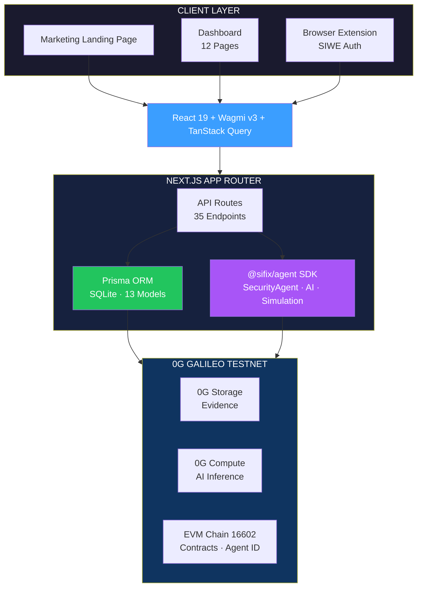

<p align="center">
  
  
  
  
  
  
  
</p>

<h1 align="center">SIFIX DApp</h1>

<p align="center">
  <strong>AI-Powered Wallet Security for Web3</strong><br/>
  Web dashboard and API backend built on <strong>0G Galileo Testnet</strong>
</p>

<p align="center">
  Real-time transaction analysis · Community-driven threat intelligence · On-chain reputation · ERC-7857 Agent Identity
</p>

---

## Table of Contents

- [Overview](#overview)
- [Features](#features)
- [Architecture](#architecture)
- [Tech Stack](#tech-stack)
- [Project Structure](#project-structure)
- [Getting Started](#getting-started)
  - [Prerequisites](#prerequisites)
  - [Installation](#installation)
  - [Environment Variables](#environment-variables)
  - [Database Setup](#database-setup)
  - [Development](#development)
  - [Build & Production](#build--production)
  - [Deployment](#deployment)
- [API Reference](#api-reference)
- [Dashboard Pages](#dashboard-pages)
- [Design System](#design-system)
- [Prisma Models](#prisma-models)
- [Hooks](#hooks)
- [Libraries](#libraries)
- [Contributing](#contributing)
- [License](#license)

---

## Overview

**SIFIX** is an AI-powered wallet security platform that protects Web3 users from scams, phishing, and malicious smart contracts. The DApp serves as both a rich web dashboard and a comprehensive REST API backend, running on the **0G Galileo Testnet** (Chain ID: 16602).

It leverages the `@sifix/agent` SDK for AI-driven security analysis and integrates with **0G Storage** for decentralized evidence archival and **0G Compute** for decentralized AI inference.

### Key Capabilities

- **AI Transaction Analysis** — Scan any address or domain for threats using the SecurityAgent SDK
- **Community Threat Intelligence** — Report, vote, and verify threats collectively
- **On-Chain Reputation** — Earn reputation points for accurate threat reporting
- **Scam Domain Database** — Community-maintained blacklist of phishing and scam websites
- **Address Tags** — Label addresses with community-voted tags
- **Watchlist** — Monitor specific addresses for risk score changes
- **ERC-7857 Agentic ID** — On-chain agent identity for automated security operations
- **Extension Support** — Browser extension API with SIWE authentication
- **0G Storage** — Decentralized storage for scan results and evidence

---

## Features

### 🔍 AI-Powered Scanning
- Address and domain scanning with risk scoring (0–100)
- Bytecode pattern detection (honeypots, unlimited approvals, self-destruct, etc.)
- AI-generated explanations and recommendations
- Batch scanning support (up to 25 addresses)

### 🛡️ Threat Intelligence
- Community-driven threat reporting with voting system
- AI confidence scoring and verification workflow
- Evidence stored on 0G Storage with root hash references
- Severity classification: LOW → MEDIUM → HIGH → CRITICAL

### 🏷️ Address Tagging
- Community tags with upvote/downvote voting
- System tags: verified, scam, phishing, drainer, honeypot, high-risk
- Category tags: DeFi, NFT, Bridge, DEX, Lending

### 👁️ Watchlist
- Monitor any address for risk score changes
- Optional alerts on score delta
- Per-user labeling

### 🤖 Agentic Identity (ERC-7857)
- On-chain agent identity via 0G Galileo testnet
- Guarded actions requiring valid agent credentials
- Token-based access control

### 🔌 Browser Extension API
- Dedicated endpoints for the SIFIX browser extension
- SIWE (Sign-In with Ethereum) nonce-based authentication
- Session management with token expiry
- Extension-specific scan and analyze endpoints

### 📊 Analytics & Leaderboard
- Platform-wide statistics
- Top contributor leaderboard
- Per-user scan history and reputation tracking

---

## Architecture



<details>
<summary>📐 ASCII Version</summary>

```
┌─────────────────────────────────────────────────────────────────┐
│                        CLIENT LAYER                             │
│  ┌──────────┐  ┌──────────────┐  ┌─────────────────────┐       │
│  │ Marketing │  │  Dashboard   │  │  Browser Extension  │       │
│  │  (Landing)│  │  (12 pages)  │  │   (SIWE Auth)       │       │
│  └─────┬─────┘  └──────┬───────┘  └──────────┬──────────┘       │
│        │               │                      │                  │
│  ┌─────▼───────────────▼──────────────────────▼──────┐          │
│  │          React 19 + Wagmi v3 + TanStack Query      │          │
│  └─────────────────────┬─────────────────────────────┘          │
└────────────────────────┼────────────────────────────────────────┘
                         │
┌────────────────────────┼────────────────────────────────────────┐
│                   NEXT.JS APP ROUTER                             │
│  ┌─────────────────────▼─────────────────────────────┐          │
│  │              API Routes (35 endpoints)             │          │
│  │  /api/v1/scan · /api/v1/analyze · /api/v1/threats  │          │
│  │  /api/v1/reports · /api/v1/watchlist · /api/v1/...  │          │
│  └──────┬──────────────────────┬─────────────────────┘          │
│         │                      │                                 │
│  ┌──────▼──────┐  ┌───────────▼───────────┐                    │
│  │   Prisma    │  │    @sifix/agent SDK    │                    │
│  │  (SQLite)   │  │  SecurityAgent · AI    │                    │
│  │  13 models  │  │  Pattern Detection     │                    │
│  └──────┬──────┘  └───────────┬───────────┘                    │
└─────────┼─────────────────────┼────────────────────────────────┘
          │                     │
┌─────────▼─────────────────────▼────────────────────────────────┐
│                    0G GALILEO TESTNET                            │
│  ┌────────────┐  ┌──────────────┐  ┌───────────────────────┐  │
│  │ 0G Storage │  │  0G Compute  │  │  EVM (Chain 16602)    │  │
│  │ (Evidence) │  │  (AI Infer)  │  │  Contracts · Agent ID │  │
│  └────────────┘  └──────────────┘  └───────────────────────┘  │
└────────────────────────────────────────────────────────────────┘
```
</details>

---

## Tech Stack

| Layer | Technology | Version |
|---|---|---|
| **Framework** | Next.js (App Router) | 16.2.3 |
| **UI** | React | 19.2.4 |
| **Language** | TypeScript | 5.x |
| **Styling** | TailwindCSS | 4.x |
| **Database** | SQLite via Prisma | 5.22.0 |
| **Wallet** | Wagmi | 3.6.9 |
| **Blockchain** | Viem | 2.48.8 |
| **AI SDK** | @sifix/agent | local |
| **AI Client** | OpenAI SDK | 6.36.0 |
| **State** | Zustand | 5.0.13 |
| **Queries** | TanStack React Query | 5.100.9 |
| **Validation** | Zod | 3.25.76 |
| **Animation** | Framer Motion | 12.38.0 |
| **Icons** | Lucide React | 1.14.0 |
| **Fonts** | Inter + Playfair Display + Geist | Google Fonts |
| **Network** | 0G Galileo Testnet | Chain ID: 16602 |

---

## Project Structure

```
sifix-dapp/
├── app/                          # Next.js App Router
│   ├── layout.tsx                # Root layout (fonts, providers, env validation)
│   ├── page.tsx                  # Marketing landing page
│   ├── globals.css               # TailwindCSS 4 + CSS custom properties
│   ├── api/                      # API routes (35 endpoints)
│   │   ├── health/route.ts
│   │   └── v1/
│   │       ├── address/[address]/        # Address CRUD + tags
│   │       ├── agentic-id/               # ERC-7857 agent identity
│   │       ├── analyze/                  # AI transaction analysis
│   │       ├── auth/                     # SIWE nonce/verify/verify-token
│   │       ├── check-domain/             # Domain safety check
│   │       ├── extension/               # Extension analyze/scan/settings
│   │       ├── history/                 # Scan history
│   │       ├── leaderboard/             # Top contributors
│   │       ├── reports/                 # Community reports + voting
│   │       ├── reputation/[address]/    # On-chain reputation
│   │       ├── scam-domains/            # Scam database + check
│   │       ├── scan/                    # Address/domain scanning
│   │       ├── scan-history/            # Scan history (alt)
│   │       ├── settings/ai-provider/   # AI provider config
│   │       ├── stats/                   # Platform statistics
│   │       ├── storage/[hash]/download/ # 0G Storage downloads
│   │       ├── tags/                    # Global tags
│   │       ├── threats/                 # Threat feed + report
│   │       └── watchlist/              # Address monitoring
│   └── dashboard/                # Dashboard pages (12)
│       ├── layout.tsx            # Dashboard shell (sidebar + header)
│       ├── page.tsx              # Dashboard home
│       ├── agent/               # Agentic ID management
│       ├── analytics/           # Platform analytics
│       ├── checker/             # Address/domain scanner
│       ├── extension/           # Extension setup guide
│       ├── history/             # Scan history
│       ├── leaderboard/         # Top contributors
│       ├── search/              # Legacy search
│       ├── settings/            # User settings
│       ├── tags/                # Community tags
│       ├── threats/             # Threat feed
│       └── watchlist/           # Address monitoring
├── components/
│   ├── auth-guard.tsx           # Wallet connection guard
│   ├── connect-button.tsx       # Wallet connect button
│   ├── error-boundary.tsx       # Error boundary wrapper
│   ├── providers.tsx            # App providers (Wagmi, QueryClient, Theme)
│   ├── blocks/                  # Landing page sections
│   │   ├── features-grid.tsx
│   │   ├── pipeline-flowchart.tsx
│   │   ├── problem-section.tsx
│   │   ├── solution-section.tsx
│   │   ├── stats-section.tsx
│   │   ├── why-sifix.tsx
│   │   └── partners-section.tsx
│   ├── dashboard/               # Dashboard-specific components
│   │   ├── header.tsx
│   │   ├── sidebar.tsx
│   │   ├── wallet-guard.tsx
│   │   ├── network-switcher.tsx
│   │   └── report-scam-modal.tsx
│   ├── marketing/               # Landing page components
│   │   ├── navbar.tsx
│   │   ├── footer.tsx
│   │   └── guarded-button.tsx
│   └── ui/                      # Shared UI components
│       ├── animated-beam.tsx
│       ├── aurora-background.tsx
│       ├── background-paths.tsx
│       ├── badge.tsx
│       ├── button.tsx / button-shadcn.tsx
│       ├── card.tsx
│       ├── cta-section.tsx
│       ├── dotted-map.tsx / world-map.tsx
│       ├── empty-state.tsx
│       ├── features.tsx / features-section.tsx
│       ├── glassmorphic-navbar.tsx
│       ├── glowy-waves-hero.tsx
│       ├── grid-feature-cards.tsx
│       ├── hero-2.tsx / hero-dithering-card.tsx / hero-odyssey.tsx
│       ├── input.tsx
│       ├── loading-spinner.tsx
│       ├── marquee.tsx
│       ├── modal.tsx
│       ├── skeleton.tsx
│       └── steps.tsx
├── config/
│   ├── chains.ts                # 0G Galileo chain definition
│   ├── contracts.ts             # Contract addresses & ABIs
│   ├── endpoints.ts             # API endpoint constants
│   └── storage.ts               # 0G Storage configuration
├── hooks/                       # Custom React hooks
│   ├── use-agentic-id.ts
│   ├── use-analytics.ts
│   ├── use-api-auth.ts
│   ├── use-balance.ts
│   ├── use-block-number.ts
│   ├── use-dashboard.ts
│   ├── use-gas-estimation.ts
│   ├── use-report-scam.ts
│   ├── use-report-threat.ts
│   ├── use-scan-history.ts
│   ├── use-scan.ts
│   ├── use-settings.ts
│   └── use-threats.ts
├── lib/                         # Core libraries & utilities
│   ├── address-validation.ts    # EIP-55 checksum + ENS validation
│   ├── agentic-id-client.ts     # ERC-7857 client
│   ├── agentic-id.ts            # Agent identity utilities
│   ├── api-client.ts            # Typed API client
│   ├── api-response.ts          # Standardized API response helpers
│   ├── constants.ts             # App-wide constants & config
│   ├── contract.ts              # Contract interaction helpers
│   ├── design-system.ts         # Design tokens (colors, spacing, shadows)
│   ├── env-validation.ts        # Environment variable validation
│   ├── error-handler.ts         # Centralized error handling
│   ├── extension-auth.ts        # Extension SIWE auth utilities
│   ├── hash.ts                  # Hashing utilities
│   ├── nonce-store.ts           # SIWE nonce management
│   ├── prisma.ts                # Prisma client singleton
│   ├── threat-intel.ts          # PrismaThreatIntel service
│   ├── utils.ts                 # General utilities (cn, formatDate, etc.)
│   ├── validations.ts           # Zod schemas
│   ├── validation.ts            # Input validation helpers
│   ├── viem.ts                  # Viem client configuration
│   ├── wagmi.ts                 # Wagmi v3 config
│   └── zerog-storage.ts         # 0G Storage upload/download
├── prisma/
│   ├── schema.prisma            # Database schema (13 models)
│   └── seed.ts                  # Database seeder
├── .env.example                 # Environment variable template
├── package.json
├── tsconfig.json
└── tailwind.config.ts
```

---

## Getting Started

### Prerequisites

- **Node.js** ≥ 18.x
- **npm**, **yarn**, or **pnpm**
- A running **0G Galileo Testnet** RPC endpoint (default: `https://evmrpc-testnet.0g.ai`)
- An **AI API key** (OpenAI-compatible endpoint)
- **MetaMask** or another EIP-1193 wallet (for development)

### Installation

```bash
# Clone the repository
git clone https://github.com/sifix/sifix-dapp.git
cd sifix-dapp

# Install dependencies (includes prisma generate via postinstall)
npm install
```

### Environment Variables

Copy the example environment file and fill in your values:

```bash
cp .env.example .env.local
```

See the [Environment Variables](#environment-variables-1) section below for the full reference.

### Database Setup

```bash
# Generate Prisma client
npm run db:generate

# Push schema to SQLite (development)
npm run db:push

# Or run migrations
npm run db:migrate

# Seed with sample data
npm run db:seed

# (Optional) Open Prisma Studio to browse data
npm run db:studio
```

### Development

```bash
npm run dev
```

Open [http://localhost:3000](http://localhost:3000) in your browser.

### Build & Production

```bash
# Build for production
npm run build

# Start production server
npm run start
```

### Deployment

The app is a standard Next.js application and can be deployed to:

- **Vercel** — zero-config deployment
- **Docker** — use a `Dockerfile` based on `node:20-alpine`
- **Node.js server** — `npm run build && npm run start`
- **Static hosting** — not supported (requires server-side API routes and Prisma)

Ensure all environment variables are set in your deployment environment.

---

## API Reference

All API routes are prefixed with `/api`. Responses follow a standardized format:

```json
{
  "success": true,
  "data": { ... },
  "error": null
}
```

### Health Check

| Method | Endpoint | Description |
|---|---|---|
| `GET` | `/api/health` | Service health check |

### Address Management

| Method | Endpoint | Description |
|---|---|---|
| `GET` | `/api/v1/address/[address]` | Get address details + risk score |
| `POST` | `/api/v1/address/[address]` | Register new address |
| `PUT` | `/api/v1/address/[address]` | Update address metadata |
| `DELETE` | `/api/v1/address/[address]` | Remove address |
| `GET` | `/api/v1/address/[address]/tags` | List tags for address |
| `POST` | `/api/v1/address/[address]/tags` | Add tag to address |
| `PUT` | `/api/v1/address/[address]/tags/[tagId]` | Update tag |
| `DELETE` | `/api/v1/address/[address]/tags/[tagId]` | Remove tag |
| `POST` | `/api/v1/address/[address]/tags/[tagId]/vote` | Vote on tag (up/down) |
| `GET` | `/api/v1/address-tags` | Global address tags list |
| `GET` | `/api/v1/tags` | Global tags list |

### Scanning & Analysis

| Method | Endpoint | Description |
|---|---|---|
| `POST` | `/api/v1/scan` | Scan address or domain |
| `GET` | `/api/v1/scan/[address]` | Get cached scan results |
| `POST` | `/api/v1/analyze` | Full AI transaction analysis (SecurityAgent) |
| `POST` | `/api/v1/check-domain` | Quick domain safety check |
| `GET` | `/api/v1/scan-history` | Scan history (paginated) |
| `GET` | `/api/v1/history` | Scan history (alt endpoint) |

### Threat Intelligence

| Method | Endpoint | Description |
|---|---|---|
| `GET` | `/api/v1/threats` | Threat feed (paginated, filterable) |
| `POST` | `/api/v1/threats/report` | Submit new threat report |
| `GET` | `/api/v1/reports` | Community reports list |
| `POST` | `/api/v1/reports/[id]/vote` | Vote on a report |
| `GET` | `/api/v1/reports/vote-status` | Check vote status for current user |

### Scam Domain Database

| Method | Endpoint | Description |
|---|---|---|
| `GET` | `/api/v1/scam-domains` | List scam domains (paginated) |
| `POST` | `/api/v1/scam-domains/check` | Check if a domain is a known scam |
| `GET` | `/api/v1/scam-domains/[domain]` | Get scam domain details |

### Reputation & Leaderboard

| Method | Endpoint | Description |
|---|---|---|
| `GET` | `/api/v1/reputation/[address]` | Get on-chain reputation score |
| `GET` | `/api/v1/leaderboard` | Top contributors leaderboard |
| `GET` | `/api/v1/stats` | Platform-wide statistics |

### Watchlist

| Method | Endpoint | Description |
|---|---|---|
| `GET` | `/api/v1/watchlist` | Get user's watchlist |
| `POST` | `/api/v1/watchlist` | Add address to watchlist |
| `DELETE` | `/api/v1/watchlist/[address]` | Remove from watchlist |

### Authentication (Extension SIWE)

| Method | Endpoint | Description |
|---|---|---|
| `GET` | `/api/v1/auth/nonce` | Get SIWE nonce for signing |
| `POST` | `/api/v1/auth/verify` | Verify SIWE signature |
| `POST` | `/api/v1/auth/verify-token` | Validate existing session token |

### Extension-Specific

| Method | Endpoint | Description |
|---|---|---|
| `POST` | `/api/v1/extension/analyze` | Extension AI analysis |
| `POST` | `/api/v1/extension/scan` | Extension address scan |
| `GET` | `/api/v1/extension/settings` | Get extension settings |

### Settings & Storage

| Method | Endpoint | Description |
|---|---|---|
| `GET` | `/api/v1/settings/ai-provider` | Get AI provider configuration |
| `PUT` | `/api/v1/settings/ai-provider` | Update AI provider settings |
| `GET` | `/api/v1/agentic-id` | Get ERC-7857 agent identity info |
| `GET` | `/api/v1/storage/[hash]/download` | Download analysis from 0G Storage |

---

## Dashboard Pages

| Route | Page | Description |
|---|---|---|
| `/` | Landing | Marketing homepage with hero, features, and CTA |
| `/dashboard` | Home | Overview cards — recent scans, stats, risk summary |
| `/dashboard/agent` | Agentic ID | ERC-7857 agent identity management |
| `/dashboard/analytics` | Analytics | Platform-wide charts and metrics |
| `/dashboard/checker` | Checker | Address/domain scanner with instant risk scoring |
| `/dashboard/extension` | Extension | Browser extension setup guide |
| `/dashboard/history` | History | Past scan results with filtering |
| `/dashboard/leaderboard` | Leaderboard | Top community contributors |
| `/dashboard/search` | Search | Legacy search interface |
| `/dashboard/settings` | Settings | User preferences, AI provider config |
| `/dashboard/tags` | Tags | Community address tags browser |
| `/dashboard/threats` | Threats | Live threat feed with reporting |
| `/dashboard/watchlist` | Watchlist | Monitored addresses with risk delta alerts |

---

## Design System

SIFIX uses a **pure-black glassmorphism** design language with carefully crafted design tokens.

### Color Palette

| Token | Value | Usage |
|---|---|---|
| Canvas | `#000000` | Page background |
| Ink | `#fcfdff` | Primary text |
| Accent Blue | `#3b9eff` | Links, primary actions |
| Accent Green | `#11ff99` | Safe / success states |
| Accent Red | `#ff2047` | Danger / critical states |
| Accent Orange | `#ff801f` | Warning states |
| Accent Yellow | `#ffc53d` | Caution states |
| Surface Card | `#0a0a0c` | Card backgrounds |
| Surface Elevated | `#101012` | Elevated surfaces |
| Surface Deep | `#06060a` | Deepest layer |
| Mute | `#a1a4a5` | Muted text |
| Hairline | `rgba(255,255,255,0.06)` | Subtle borders |
| Hairline Strong | `rgba(255,255,255,0.14)` | Emphasized borders |

### Glass Card Pattern

```css
.glass-card {
  background: rgba(255, 255, 255, 0.05);
  border: 1px solid rgba(255, 255, 255, 0.1);
  backdrop-filter: blur(16px);
}
```

### Typography

- **Body font**: Inter / Geist (sans-serif)
- **Display font**: Playfair Display (serif — headlines, branding)
- **Monospace**: System monospace for addresses, hashes

### Icons

All icons use **Lucide React** (`lucide-react` v1.14.0) for a consistent, lightweight icon set.

### Animation

- **Framer Motion** for page transitions, card animations, and interactive effects
- **tw-animate-css** for utility-first CSS animations
- **@paper-design/shaders-react** for WebGL shader effects
- **tsparticles** for particle backgrounds
- **cobe** for 3D globe visualizations

---

## Environment Variables

### Required

| Variable | Description | Example |
|---|---|---|
| `DATABASE_URL` | SQLite database path | `file:./dev.db` |
| `NEXT_PUBLIC_ZG_RPC_URL` | 0G Galileo RPC endpoint | `https://evmrpc-testnet.0g.ai` |
| `NEXT_PUBLIC_ZG_CHAIN_ID` | Chain ID for 0G Galileo | `16602` |
| `AI_API_KEY` | API key for AI provider | `sk-...` |

### Optional — Wallet & Chain

| Variable | Description | Default |
|---|---|---|
| `NEXT_PUBLIC_WALLETCONNECT_PROJECT_ID` | WalletConnect Cloud project ID | — |

### Optional — AI Provider

| Variable | Description | Default |
|---|---|---|
| `AI_BASE_URL` | OpenAI-compatible API base URL | — |
| `AI_MODEL` | Model identifier | `glm/glm-5.1` |

### Optional — 0G Storage

| Variable | Description | Default |
|---|---|---|
| `ZG_INDEXER_URL` | 0G Storage indexer URL | `https://indexer-storage-testnet-turbo.0g.ai` |
| `STORAGE_PRIVATE_KEY` | Server wallet key for uploads | — |
| `STORAGE_MOCK_MODE` | Use mock storage (no real uploads) | `true` |

### Optional — 0G Compute

| Variable | Description | Default |
|---|---|---|
| `COMPUTE_PRIVATE_KEY` | Server wallet key for compute | — |
| `COMPUTE_PROVIDER_ADDRESS` | 0G Compute provider address | — |

### Optional — Agentic ID (ERC-7857)

| Variable | Description | Default |
|---|---|---|
| `NEXT_PUBLIC_AGENTIC_ID_CONTRACT_ADDRESS` | ERC-7857 contract address | `0x2700F6A3...` |
| `NEXT_PUBLIC_AGENTIC_ID_TOKEN_ID` | Agent token ID (after minting) | — |

### Optional — Contracts

| Variable | Description | Default |
|---|---|---|
| `NEXT_PUBLIC_SIFIX_CONTRACT` | SIFIX main contract address | — |
| `NEXT_PUBLIC_FLOW_CONTRACT` | Flow contract address | — |

---

## Prisma Models

The database uses **SQLite** with **13 models** organized into three domains:

### Core Models

- **Address** — Tracked blockchain addresses with risk scoring (LOW / MEDIUM / HIGH / CRITICAL)
- **ThreatReport** — Community-reported threats with AI analysis, evidence hashes, and verification status
- **TransactionScan** — Individual transaction scan results with simulation data and AI recommendations
- **ReputationScore** — Per-address reputation: overall, reporter accuracy, and on-chain sync

### System Models

- **UserProfile** — User statistics (scans, threats detected, reports submitted) and notification preferences
- **SearchHistory** — Historical search queries with risk scores and result snapshots
- **SyncLog** — Synchronization audit log (0G Storage, contract sync events)
- **ScamDomain** — Blacklisted domains with categories (PHISHING, MALWARE, SCAM, RUGPULL, FAKE\_AIRDROP)
- **ScanHistory** — Detailed scan records with 0G Storage root hash references

### User Settings Models

- **UserSettings** — Per-address AI provider configuration (openai, groq, 0g-compute, ollama, custom)
- **ExtensionSession** — Browser extension session tokens with expiry management
- **AddressTag** — Community tags with upvote/downvote voting (unique per address+tag)
- **Watchlist** — User-monitored addresses with risk score tracking and alert configuration

---

## Hooks

Custom React hooks for data fetching and state management:

| Hook | Description |
|---|---|
| `use-scan` | Scan addresses and domains, manage scan state |
| `use-scan-history` | Paginated scan history retrieval |
| `use-threats` | Threat feed with filtering and pagination |
| `use-report-threat` | Submit threat reports via mutation |
| `use-report-scam` | Report scam domains |
| `use-dashboard` | Dashboard overview data aggregation |
| `use-analytics` | Platform analytics data |
| `use-agentic-id` | ERC-7857 agent identity state |
| `use-api-auth` | Extension SIWE authentication flow |
| `use-settings` | User settings management |
| `use-balance` | Wallet balance via Wagmi |
| `use-block-number` | Current block number |
| `use-gas-estimation` | Gas price estimation |

---

## Libraries

### Core Libraries (`lib/`)

| File | Description |
|---|---|
| `prisma.ts` | Prisma client singleton |
| `wagmi.ts` | Wagmi v3 configuration for 0G Galileo |
| `viem.ts` | Viem v2 client setup |
| `api-client.ts` | Typed fetch wrapper for API routes |
| `api-response.ts` | Standardized `{ success, data, error }` helpers |
| `constants.ts` | Risk thresholds, scam patterns, pagination, rate limits |
| `design-system.ts` | Color tokens, spacing, shadows, breakpoints |
| `env-validation.ts` | Runtime environment variable validation |
| `error-handler.ts` | Centralized error handling utilities |
| `utils.ts` | `cn()` (class merging), `formatDate()`, and general helpers |
| `validations.ts` / `validation.ts` | Zod schemas for API input validation |
| `address-validation.ts` | EIP-55 checksum validation and ENS resolution |
| `agentic-id.ts` / `agentic-id-client.ts` | ERC-7857 agent identity utilities |
| `contract.ts` | Smart contract interaction helpers |
| `extension-auth.ts` | Extension SIWE authentication logic |
| `nonce-store.ts` | SIWE nonce generation and management |
| `hash.ts` | Cryptographic hashing utilities |
| `threat-intel.ts` | PrismaThreatIntel service class |
| `zerog-storage.ts` | 0G Storage upload and download |

---

## Contributing

We welcome contributions! Here's how to get started:

### Development Workflow

1. **Fork** the repository
2. **Create** a feature branch: `git checkout -b feature/my-feature`
3. **Develop** with the dev server: `npm run dev`
4. **Lint** your code: `npm run lint`
5. **Test** thoroughly across all affected endpoints/pages
6. **Commit** with descriptive messages
7. **Push** and open a Pull Request

### Guidelines

- Follow the existing TypeScript strict patterns
- Use **Zod** for all API input validation
- Maintain the glassmorphism design system for UI changes
- Add proper error handling for all new API routes
- Update this README if you add new endpoints, models, or pages
- Ensure all environment variables are documented in `.env.example`

### Code Style

- TypeScript strict mode (where applicable)
- Functional React components with hooks
- TailwindCSS utility classes (no custom CSS without good reason)
- Prisma for all database operations
- Consistent API response format via `api-response.ts`

---

## License

This project is licensed under the **MIT License**.

---

<p align="center">
  Built with ❤️ on <strong>0G Galileo Testnet</strong><br/>
  <sub>SIFIX — AI-Powered Wallet Security</sub>
</p>
