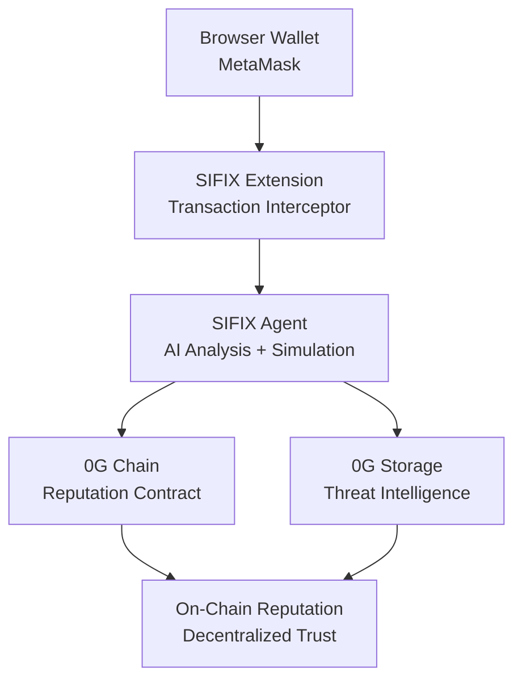

# SIFIX - AI-Powered Wallet Security for Web3

**Autonomous AI agent that protects Web3 users by intercepting wallet transactions, simulating them, analyzing risks using AI, and reporting threats to an on-chain reputation system.**

Built for 0G Chain APAC Hackathon 2026.

## 🎯 Problem

Web3 users face constant threats:
- Phishing attacks
- Malicious smart contracts
- Rug pulls
- Approval scams
- Hidden risks in complex DeFi interactions

## 💡 Solution

SIFIX adds an AI security layer between users and blockchain:

1. **Intercept** - Catches transactions before execution
2. **Simulate** - Runs transaction in safe environment
3. **Analyze** - AI evaluates risks and explains threats
4. **Report** - Shares threat intelligence on-chain
5. **Protect** - Users make informed decisions

## 🏗️ Architecture



## 📦 Tech Stack

- **Frontend:** Next.js 15 + React 19 + TailwindCSS
- **Wallet:** RainbowKit + Wagmi + Viem
- **Backend:** Next.js API Routes + Prisma
- **Database:** PostgreSQL / SQLite
- **Extension:** Plasmo + Manifest V3
- **Agent:** TypeScript + OpenAI GPT-4 + Viem
- **Contracts:** Solidity + Foundry
- **Chain:** 0G Newton Testnet (Chain ID: 16602)
- **Storage:** 0G Storage (decentralized threat intelligence)

## 🚀 Quick Start

### Prerequisites

- Node.js 18+
- pnpm
- PostgreSQL or SQLite

### Installation

```bash
# Clone repo
git clone https://github.com/sifix-ai/sifix-dapp
cd sifix-dapp

# Install dependencies
pnpm install

# Setup environment
cp .env.example .env.local
# Edit .env.local with your credentials

# Run migrations
pnpm prisma migrate dev

# Seed database (optional)
pnpm prisma db seed

# Start dev server
pnpm dev
```

Open http://localhost:3000

## 🛡️ Features

### Dashboard
- **Search** - Query address reputation and scan for threats
- **Threat Monitor** - Real-time threat reports from community
- **Analytics** - Statistics, charts, and threat trends
- **Leaderboard** - Top security reporters

### Browser Extension
- **Transaction Interception** - Catches all wallet transactions
- **Real-time Analysis** - AI-powered risk assessment
- **Visual Warnings** - Clear threat indicators
- **One-Click Block** - Stop malicious transactions

### AI Agent
- **Transaction Simulation** - Safe execution preview
- **GPT-4 Analysis** - Natural language risk explanation
- **Pattern Recognition** - Detect known attack vectors
- **Continuous Learning** - Improves from community reports

### Smart Contracts
- **Reputation System** - On-chain trust scores
- **Threat Reporting** - Decentralized threat database
- **Immutable Records** - Transparent security history

## 🔗 Contract Addresses

### 0G Newton Testnet

- **SifixReputation:** `0x544a39149d5169E4e1bDf7F8492804224CB70152`
- **Flow Contract:** `0x22E03a6A89B950F1c82ec5e74F8eCa321a1a3F12`
- **Network:** 0G Newton Testnet
- **Chain ID:** 16602
- **RPC:** https://evmrpc-testnet.0g.ai
- **Explorer:** https://chainscan-newton.0g.ai

## 📚 Documentation

Full documentation available at: https://github.com/sifix-ai/sifix-docs

## 🤝 Contributing

We welcome contributions! Please see [CONTRIBUTING.md](CONTRIBUTING.md) for details.

## 📄 License

MIT License - see [LICENSE](LICENSE) for details.

## 🏆 Hackathon

Built for **0G Chain APAC Hackathon 2026**

**Team:** Butuh Uwang  
**Deadline:** May 16, 2026

## 🔗 Links

- **GitHub Org:** https://github.com/sifix-ai
- **dApp:** https://github.com/sifix-ai/sifix-dapp
- **Extension:** https://github.com/sifix-ai/sifix-extension
- **Contracts:** https://github.com/sifix-ai/sifix-contracts
- **Agent:** https://github.com/sifix-ai/sifix-agent
- **Docs:** https://github.com/sifix-ai/sifix-docs

## 🙏 Acknowledgments

- 0G Chain team for the amazing infrastructure
- OpenAI for GPT-4 API
- RainbowKit & Wagmi for wallet integration
- Foundry for smart contract development
